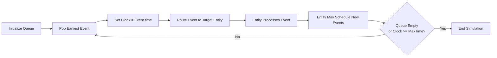

# How to Architect a Modern Edge Simulation Framework

Building a Discrete Event Simulator (DES) requires a specific architectural mindset. You are not building a real-time game engine; you are building a time-traveling state machine. This document provides a language-agnostic blueprint covering the core paradigm, component architecture, tech stack decisions, and development best practices.

---

## 1. The Core Paradigm: Discrete Event Simulation

Do **not** use a time-stepped loop (e.g., checking every millisecond to see if an event has occurred). Time-stepped loops are computationally wasteful because nothing changes in most milliseconds of a simulation. DES solves this elegantly.

### How DES Works

Instead of asking *"What time is it? What should I do?"* at every tick, the engine maintains a **Priority Queue (Min-Heap)** of future events, ordered by their scheduled timestamps.



**Example Flow:**
1. Insert events: `[Task_Arrival at t=1.2]`, `[Battery_Dead at t=5.0]`.
2. Pop the lowest time: `t=1.2` (Task_Arrival).
3. Set the global clock to `1.2`.
4. Execute logic for `Task_Arrival`. The logic calculates the task takes 2.0 seconds, so it injects a new event: `[Task_Complete at t=3.2]`.
5. Pop the next lowest time: `t=3.2` (Task_Complete).
6. Repeat.

**Key Insight:** If the next event is at `t=100.0`, the clock jumps 98.8 seconds instantly. This is why DES is orders of magnitude faster than time-stepped simulation for sparse-event scenarios.

---

## 2. Component Architecture

### A. The Engine (Clock + Queue)

The engine is the central nervous system. It knows nothing about Edge computing — it is a generic event processor.

```python
class SimulationEngine:
    def __init__(self, seed: int):
        self.clock = 0.0
        self.queue = MinHeap()
        self.rng = Random(seed)  # Global PRNG for reproducibility
        self.entities = {}       # id -> SimEntity
    
    def schedule(self, delay: float, event_type: str, 
                 target_id: str, data: Any = None):
        absolute_time = self.clock + delay
        event = Event(absolute_time, event_type, target_id, data)
        self.queue.push(event)
    
    def run(self, max_time: float):
        while self.queue and self.clock < max_time:
            event = self.queue.pop()
            self.clock = event.time  # Jump forward in time
            entity = self.entities[event.target_id]
            entity.handle_event(event)
```

### B. Entities (The Physical World)

Every physical thing inherits from a `SimEntity` base class. Entities hold state (RAM, MIPS, Battery, Location) and implement `handle_event()`.

```python
class SimEntity:
    def __init__(self, id: str, engine: SimulationEngine):
        self.id = id
        self.engine = engine
        self.engine.entities[id] = self  # Register with engine
    
    def handle_event(self, event: Event):
        """Override this in subclasses."""
        raise NotImplementedError

class ComputingNode(SimEntity):
    def __init__(self, id, engine, mips, cores, ram, battery, x, y):
        super().__init__(id, engine)
        self.mips = mips          # Million Instructions Per Second
        self.cores = cores        # Parallel execution capacity
        self.ram = ram            # Available RAM (MB)
        self.battery = battery    # Remaining battery (mAh)
        self.x = x                # X coordinate (meters)
        self.y = y                # Y coordinate (meters)
        self.alive = True
```

**Important design rule:** Entities are data containers plus reaction logic. They do not hold the *orchestration algorithm*. That is delegated to the orchestrator (see section D).

### C. Topology Manager (The Network Graph)

Edge networks are not a single bus. Data must route through intermediate nodes, and links have weight (latency, bandwidth). This is a graph problem.

```python
# Using a graph library (e.g., NetworkX in Python, petgraph in Rust)
class TopologyManager:
    def __init__(self):
        self.graph = nx.Graph()
    
    def add_link(self, node_a: str, node_b: str, 
                 latency: float, bandwidth: float):
        self.graph.add_edge(node_a, node_b, 
                            weight=latency, 
                            bandwidth=bandwidth)
    
    def update_link(self, node_a: str, node_b: str, 
                    new_bandwidth: float):
        """Handle dynamic link changes (congestion, mobility)."""
        self.graph[node_a][node_b]['bandwidth'] = new_bandwidth
        self.graph[node_a][node_b]['weight'] = calculate_latency(...)
    
    def get_transmission_delay(self, source: str, dest: str, 
                               data_size_mb: float) -> float:
        """Compute total delay from source to destination."""
        path = nx.shortest_path(self.graph, source, dest, weight='weight')
        total_delay = 0.0
        for i in range(len(path) - 1):
            a, b = path[i], path[i+1]
            edge = self.graph[a][b]
            # Propagation delay (fixed by distance)
            total_delay += edge['weight']
            # Transmission delay (depends on data size)
            total_delay += data_size_mb / edge['bandwidth']
        return total_delay
```

### D. The Orchestrator (The Extension Point)

This is **the** most important module. It is where researchers plug in their custom algorithm. It must be completely decoupled from the engine and the entity models.

```python
class Orchestrator(SimEntity):
    """
    Abstract orchestrator. Users override find_computing_node().
    The orchestrator listens for 'REQUEST_OFFLOAD' events,
    applies its algorithm, and sends an 'ASSIGN_TASK' event.
    """
    
    def handle_event(self, event: Event):
        if event.type == 'REQUEST_OFFLOAD':
            task = event.data
            task.generator_id = event.source_id
            target = self.find_computing_node(task)
            if target:
                self.engine.schedule(0, 'ASSIGN_TASK', target.id, task)
            else:
                self.engine.schedule(0, 'TASK_DROPPED', task.generator_id, task)
    
    def find_computing_node(self, task) -> ComputingNode:
        """Override this with your algorithm."""
        raise NotImplementedError

# Example concrete implementation
class RoundRobinOrchestrator(Orchestrator):
    def __init__(self, id, engine, nodes):
        super().__init__(id, engine)
        self.nodes = nodes
        self.counter = 0
    
    def find_computing_node(self, task):
        node = self.nodes[self.counter % len(self.nodes)]
        self.counter += 1
        return node
```

### E. Workload Generator (Stochastic Processes)

Real traffic is bursty, not constant. Generators should support statistical distributions.

```python
class PoissonTaskGenerator(SimEntity):
    """
    Generates tasks at intervals modeled by a Poisson process.
    The inter-arrival time follows an exponential distribution.
    """
    def __init__(self, id, engine, orchestrator_id, 
                 lambda_rate: float, task_length_range: tuple):
        super().__init__(id, engine)
        self.orchestrator_id = orchestrator_id
        self.lambda_rate = lambda_rate  # Average tasks per second
        self.min_length, self.max_length = task_length_range
        self.schedule_next_task()
    
    def schedule_next_task(self):
        # Use the engine's global RNG for reproducibility
        interval = self.engine.rng.exponential(1.0 / self.lambda_rate)
        self.engine.schedule(interval, 'GENERATE_TASK', self.id)
    
    def handle_event(self, event: Event):
        if event.type == 'GENERATE_TASK':
            task_length = self.engine.rng.uniform(self.min_length, self.max_length)
            task = Task(length=task_length, generated_at=self.engine.clock)
            self.engine.schedule(0, 'REQUEST_OFFLOAD', self.orchestrator_id, task)
            self.schedule_next_task()
```

### F. Metrics Collector (Telemetry)

A passive listener that gathers data without interfering with the simulation.

```python
class MetricsCollector:
    def __init__(self):
        self.records = []  # List of dicts
    
    def observe(self, event: Event, engine: SimulationEngine):
        """Call this from entities when interesting state changes occur."""
        record = {
            'time': engine.clock,
            'type': event.type,
            'entity': event.target_id,
            'data': str(event.data)
        }
        self.records.append(record)
    
    def to_csv(self, path: str):
        import csv
        if not self.records:
            return
        with open(path, 'w', newline='') as f:
            writer = csv.DictWriter(f, fieldnames=self.records[0].keys())
            writer.writeheader()
            writer.writerows(self.records)
    
    def to_dataframe(self):
        import pandas as pd
        return pd.DataFrame(self.records)
```

---

## 3. Technology Stack Decision Matrix

| Language | Best For | DES Library | ML Integration | Raw Speed |
|----------|----------|-------------|----------------|-----------|
| **Python** | AI/ML Research, Rapid Prototyping | `SimPy`, custom `heapq` | Native (PyTorch, TF, Gym) | Medium |
| **Rust** | Maximum Scale, Memory Safety | Custom (std `BinaryHeap`) | Foreign (FFI to Python/TF) | Very High |
| **Go** | Concurrency, Moderate Scale | Custom with goroutines | Foreign | High |
| **Java** | Academic OOP, CloudSim compat | Custom | Foreign (bridge via files) | Medium-High |
| **C++** | Performance-critical components | Custom | Foreign | Highest |

### Recommended Stack for a New Project

**If the goal is AI/Edge research (most common use case):**
- **Language:** Python 3.11+
- **DES Engine:** Custom implementation over `heapq` (SimPy's event processing can be too slow for 100k+ node scenarios; a custom engine is more performant).
- **Graph:** `NetworkX` (prototyping) with optional `igraph` for performance-critical routing.
- **Spatial Indexing:** `scipy.spatial.KDTree` or `pyqtree` for mobile node proximity queries.
- **Telemetry:** `Pandas` + `Matplotlib` / `Plotly`.
- **Configuration:** `PyYAML` or `json`.

**If the goal is maximum scalability (millions of nodes):**
- **Language:** Rust
- **DES Engine:** Custom (use `std::collections::BinaryHeap`)
- **Graph:** `petgraph`
- **Spatial Indexing:** `kiddo` (Rust KD-Tree crate)

---

## 4. Development Best Practices

### 4.1 Decouple Logic from State
Your orchestration algorithm should live in a separate class, not be hardcoded into the `EdgeServer` or `IoTSensor` class. This enables the pluggable architecture that researchers need.

### 4.2 Use YAML/JSON for Configuration
Avoid XML (verbose, complex parsing). Modern researchers prefer YAML for readability:

```yaml
# scenario.yaml
simulation:
  duration: 86400   # 24 hours
  seed: 42

devices:
  iot_sensors:
    count: 1000
    mips: 100
    cores: 1
    ram_mb: 64
    battery_mah: 200
    mobility: random_walk

  edge_servers:
    count: 10
    mips: 32000
    cores: 16
    ram_mb: 65536
    battery_mah: -1     # -1 means infinite (plugged in)
    mobility: none      # Static
```

### 4.3 Seed Everything
Create a single global `Random` instance in the engine and pass it to every component that needs randomness. Never use `math.random()` or `System.currentTimeMillis()` inside entities.

**Wrong:**
```python
class MyEntity(SimEntity):
    def generate_random(self):
        return random.random()  # Uses system seed — NOT reproducible!
```

**Right:**
```python
class MyEntity(SimEntity):
    def generate_random(self):
        return self.engine.rng.random()  # Uses global seed — reproducible!
```

### 4.4 Separate Scenario Definition from Execution
The user writes a YAML file describing the topology. A separate `ScenarioBuilder` class parses this YAML and constructs the engine, entities, and metrics collector. This separation of concerns allows users to run hundreds of experiments by just changing a config file.

### 4.5 Build an OpenAI Gym Wrapper (If Python)
If you build in Python, providing a Gym-compatible `env` class dramatically increases adoption for RL research:

```python
class EdgeSimEnv(gym.Env):
    """
    Wraps the simulation as a reinforcement learning environment.
    action: choose a computing node for the current task.
    observation: state vector (CPU, battery, latency of all nodes).
    reward: negative of (task completion time + energy cost).
    """
    
    def __init__(self, config_path: str):
        # Build the simulator from config
        self.engine = build_simulator(config_path)
        self.current_task = None
    
    def step(self, action):
        # action is the index of the target node
        target = self.engine.entities[action]
        # Assign the task, run the sim until the next offload decision
        metrics = self.engine.process_until_next_decision(target, self.current_task)
        obs = self._get_observation()
        reward = metrics.get_reward()
        done = self.engine.clock >= self.engine.max_time
        return obs, reward, done, metrics
    
    def reset(self):
        self.engine = build_simulator(self.config_path)
        return self._get_observation()
```

---

## 5. Common Pitfalls and How to Avoid Them

| Pitfall | Consequence | Solution |
|---------|-------------|----------|
| **Time-stepped loop** | 100x slower simulation, hard to scale | Use DES with priority queue |
| **Hardcoded orchestration** | Users cannot extend the simulator | Use Strategy pattern / interface |
| **Non-deterministic RNG** | Results differ across runs, papers rejected | Global seeded RNG, passed to all components |
| **Thread safety ignored** | Race conditions when running parallel scenarios | Each scenario gets its own engine+entities (no shared state) |
| **No metrics export** | Researchers cannot get results from the tool | Built-in metrics collector with CSV/DataFrame export |
| **Complex XML configuration** | High learning curve, errors are cryptic | Use YAML/JSON with schema validation |
| **Java/Python bridge** | 2x-5x overhead for each offload decision | If the goal is ML integration, build natively in Python |

---

## 6. Summary: The 7-Layer Architecture

```
┌─────────────────────────────────────────────────────────┐
│                   User Config (YAML)                     │
├─────────────────────────────────────────────────────────┤
│                Scenario Builder (Parser)                 │
├──────────┬──────────┬──────────┬──────────┬─────────────┤
│  Engine  │ Entities │Topology │Orchestr. │ Workload    │
│  (Queue) │ (Nodes)  │(Graph)  │(Plugin)  │(Generators) │
├──────────┴──────────┴──────────┴──────────┴─────────────┤
│                  Metrics Collector                       │
├─────────────────────────────────────────────────────────┤
│              Export (CSV / DataFrame / Live Viz)         │
└─────────────────────────────────────────────────────────┘
```

1. **User Config (YAML):** Defines what to simulate (devices, topology, algorithms).
2. **Scenario Builder:** Parses the config, instantiates the engine + entities.
3. **Engine:** Global clock + priority queue of `Event` objects.
4. **Entities:** `SimEntity` subclasses representing hardware (IoT Sensors, Edge Servers, Cloud).
5. **Topology Manager:** Graph of network links with latency/bandwidth weights.
6. **Orchestrator:** The user's custom algorithm for task placement (the research contribution).
7. **Metrics Collector:** Passive recorder of events → CSV/DataFrame exports.
