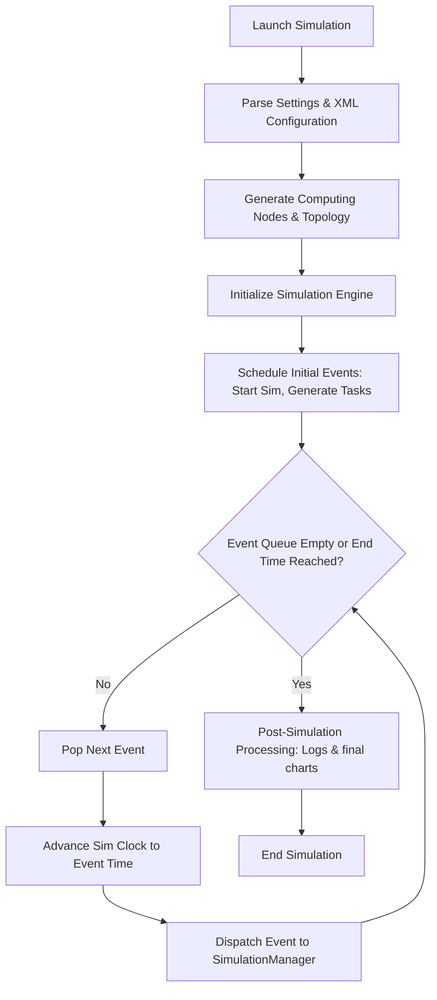

# PureEdgeSim Developer & Architecture Documentation

PureEdgeSim is a simulation framework for performance evaluation of Cloud, Edge, and Mist Computing environments. It is built on top of a custom Discrete Event Simulation (DES) engine and simulates task offloading, container registries, networks (WiFi, Cellular, Ethernet, MAN, WAN), energy consumption, and node mobility.

This document serves as a guide for developers and researchers wishing to understand the internal structure of the simulator, its lifecycle, and how to customize or tune it.

---

## 1. High-Level Architecture & DES Engine

At its core, PureEdgeSim uses the **Discrete Event Simulation (DES)** paradigm. Instead of simulating time continuously, it maintains a queue of future events. The simulation clock jumps from the timestamp of one event to the next, executing the logic associated with each event.

### Key Simulation Engine Classes (`com.mechalikh.pureedgesim.simulationengine`)
*   **`PureEdgeSim`**: The central orchestrator of the DES loop. It controls the simulation clock (`clock`), maintains the priority queue of future events (`FutureQueue`), and dispatches events to registered listeners (`SimulationListener`).
*   **`Event`**: Represents a discrete event. It contains:
    *   `time`: The simulation time at which the event occurs.
    *   `tag`: An integer identifier (e.g., `START_SIMULATION`, `GENERATE_TASK`, `UPDATE_MOBILITY`).
    *   `src`: The sender computing node / component ID.
    *   `dest`: The destination computing node / component ID.
    *   `data`: An arbitrary object containing context payload.
*   **`FutureQueue`**: A priority queue storing events ordered chronologically by their execution time.

---

## 2. Package-by-Package Breakdown

### `com.mechalikh.pureedgesim.scenariomanager`
Responsible for loading configurations and properties.
*   **`SimulationParameters`**: Global static settings (map dimensions, network latency/bandwidth, orchestrator configuration, etc.).
*   **`ParametersParser`**: Reads and asserts settings from `simulation_parameters.properties`.
*   **XML Parsers (`EdgeDevicesParser`, `DatacentersParser`, `ApplicationFileParser`)**: Parse XML files describing workloads, data centers, and devices.

### `com.mechalikh.pureedgesim.datacentersmanager`
Manages computing resource lifecycles.
*   **`ComputingNode`**: Represents a simulation entity (Cloud server, Edge data center, or Edge device). Tracks hardware specifications (MIPS, CPU cores, RAM, storage, battery), position coordinates, and status (alive/dead/disconnected).
*   **`DefaultComputingNodesGenerator`**: Spawns physical devices and edge nodes at startup according to configuration bounds.
*   **`DefaultTopologyCreator`**: Generates connection links (topology graphs) between nodes based on ranges and coordinates.

### `com.mechalikh.pureedgesim.network`
Simulates network channels, bandwidth, and latency.
*   **`NetworkLink`**: Models physical links (WAN, MAN, Wifi, Cellular, Ethernet) with specific bandwidth limits, latency penalties, and energy models.
*   **`DefaultNetworkModel`**: Computes data transmission delays, handles network contention (sharing bandwidth among active transfers), and schedules transfer completion events.

### `com.mechalikh.pureedgesim.energy`
Tracks power consumption.
*   **`EnergyModelComputingNode`**: Computes dynamic battery usage based on CPU load (idle vs active wattage) and networking events (transmission and reception states).

### `com.mechalikh.pureedgesim.taskgenerator`
Generates simulation workloads.
*   **`Task`**: The unit of work containing computation requirement (CPU cycles in MI), data size (input/output size in MB), latency tolerance, and current state (scheduled, executing, finished, failed).
*   **`DefaultTaskGenerator`**: Spawns tasks based on application profiles, assigning them to source devices.

### `com.mechalikh.pureedgesim.taskorchestrator`
Determines task routing decisions.
*   **`Orchestrator` & `DefaultOrchestrator`**: Decide whether to execute tasks locally on the device, offload to adjacent edge nodes, or route them to the central cloud. Implements policies like `EDGE_ONLY`, `CLOUD_ONLY`, and `TRADE_OFF`.

### `com.mechalikh.pureedgesim.simulationmanager`
Integrates the simulator's components.
*   **`Simulation`**: Handles sequential or parallel execution, initializes parsers, and creates threads.
*   **`DefaultSimulationManager`**: Implements the main simulation loop dispatcher by handling events such as `GENERATE_TASK`, `EXECUTE_TASK`, `NETWORK_TRANSFER_COMPLETE`, and logging metrics.

---

## 3. Simulation Lifecycle

When a simulation is run (e.g. by calling `new Simulation().launchSimulation()`), the lifecycle progresses as follows:



1.  **Parsing Phase**: Configs are loaded. Custom settings are mapped onto `SimulationParameters`.
2.  **Creation Phase**: Computing nodes (devices, edges, clouds) are spawned and mapped to positions. The topology generator binds them together with appropriate `NetworkLink` objects.
3.  **Bootstrap Phase**: An event `START_SIMULATION` is queued at time `0.0`.
4.  **Main Event Loop**:
    *   `START_SIMULATION` triggers the generation of the initial batch of tasks.
    *   As tasks are generated, they trigger `ORCHESTRATE_TASK` events.
    *   The `Orchestrator` assigns each task to a destination node, creating network transfer events (`NETWORK_TRANSFER_COMPLETE`) for the upload.
    *   Once upload completes, the task is queued on the destination node CPU, scheduling `TASK_EXECUTION_COMPLETE`.
    *   Dynamic events like `UPDATE_MOBILITY` occur periodically, updating node positions and modifying network topologies on the fly.
5.  **Shutdown Phase**: Once the clock exceeds the simulation duration, final result metrics are aggregated into CSVs and comparison PNGs.

---

## 4. Key Parameters & Tuning Guide

Researchers can configure the following static variables in `SimulationParameters` to adapt the simulation context:

### Network Constraints
*   `realisticNetworkModel`: When `true`, enables dynamic network sharing where multiple concurrent uploads/downloads compete for bandwidth, increasing realism but using more computing overhead.
*   `wanBandwidthBitsPerSecond` / `wanLatency` / `wanWattHourPerBit`: Defines the core cloud network connection qualities.
*   `wifiBandwidthBitsPerSecond` / `wifiLatency`: Standard parameters for local D2D and edge access point WiFi links.
*   `cellularBandwidthBitsPerSecond` / `cellularLatency`: Parameters representing 4G/5G mobile link connections.

### Physical/Spatial Constraints
*   `simulationMapLength` / `simulationMapWidth`: Area boundaries (in meters) wherein devices move.
*   `edgeDevicesRange`: Wifi broadcast distance for device-to-device (D2D) linking.
*   `edgeDataCentersRange`: Spatial range for connecting to an Edge cell tower / access point.

### Logic Settings
*   `enableRegistry` / `registryMode`: Simulates pull/download delays for containerized software before running tasks.
*   `enableOrchestrators` / `deployOrchestrators`: Adds intermediate decision nodes that route tasks dynamically.

---

## 5. Writing Custom Modules

PureEdgeSim is designed to be extensible. Researchers can inject custom behavior by extending key classes and passing them to the simulation instance.

### Example: Injecting a Custom Orchestrator
```java
public class MyCustomOrchestrator extends DefaultOrchestrator {
    public MyCustomOrchestrator(SimulationManager simManager) {
        super(simManager);
    }

    @Override
    public ComputingNode findComputingNode(String[] architecture, Task task) {
        // Implement custom routing logic here
        // e.g. offload only if device battery is below 20%
        if (task.getSourceDevice().getBatteryLevel() < 0.2) {
            return getCloudNode();
        }
        return task.getSourceDevice(); // Run locally
    }
}
```
Register it in your launcher application:
```java
Simulation sim = new Simulation();
sim.setCustomEdgeOrchestrator(MyCustomOrchestrator.class);
sim.launchSimulation();
```
Similar overrides can be written for `MobilityModel` (device movements) and `TaskGenerator` (workload profiles).

---

## 6. CLI Engine & Custom Parameter Parser

We have removed the old web-based GUI in favor of a fast, keyboard-driven Command Line Interface (CLI) implemented in `MainApplication.java`. It can be run in two modes:

### Parameter-Based Mode (Headless / Scripted)
You can directly pass command-line arguments to override parameters. This is highly suitable for remote servers or background scripting:
```bash
mvn exec:java -Dexec.mainClass="com.mechalikh.pureedgesim.MainApplication" -Dexec.args="--time 120.0 --devices 500 --parallel false"
```

#### Available Command-Line Arguments:
*   `-c`, `--config <path>`: Properties configuration file path.
*   `-a`, `--apps <path>`: Applications XML file path.
*   `-d`, `--devices <int>`: Total device count to simulate.
*   `-t`, `--time <double>`: Simulation time (in minutes).
*   `-p`, `--parallel <true|false>`: Enable/disable parallel scenario execution.
*   `-s`, `--save-charts <true|false>`: Whether to output final results PNG charts.
*   `-l`, `--save-log <true|false>`: Save the iteration run log to a file.
*   `-v`, `--verbose <true|false>`: Enable deep verbose trace log statements.
*   `-b`, `--batch <int>`: Task scheduling batch size.
*   `-dc`, `--display-charts <true|false>`: Enable/disable live Swing JFrame real-time charts.
*   `-rn`, `--realistic-net <true|false>`: Enable/disable the realistic bandwidth network model.

### Interactive Menu-Based Mode (Console UI)
If launched without arguments, the CLI boots into a command loop:
```
===== PureEdgeSim CLI Configuration Menu =====
1. Start Simulation with active configuration
2. Configure General Settings (time, devices count, logging, etc.)
3. Configure Network & Map Settings (bandwidth, latencies, range, etc.)
4. Configure Orchestration & Registry Settings
5. Configure File Paths & Folders
6. View Current Configurations
7. Exit
```

---

## 7. Quirks, Edge Cases & Troubleshooting

Below are critical framework quirks, edge cases, and design constraints that you should keep in mind:

### 1. Parallel Simulations vs Swing Live Charts
*   **The Quirk**: When you set **Parallel Simulation** to `true` (enabling concurrent thread pools to run different simulation configurations simultaneously), the framework **automatically disables** both the real-time Swing Live Charts (`displayRealTimeCharts = false`) and the final results charts saving (`saveCharts = false`).
*   **Why**: Concurrent threads trying to open and render inside overlapping Swing `JFrame` windows will lead to AWT thread locks or visual corruption. Similarly, concurrent threads writing results to the same output image files causes corrupt file generation.
*   **Fix**: If you need to view live charts or save output charts, configure **Parallel Simulation** to `false` (run sequentially).

### 2. Strict CLI Input Validation & Typing
*   **The Quirk**: Typing values into the console settings prompts requires strict compliance. Typos in Boolean settings (e.g. entering `yes` or `t` instead of `true`/`false`) will raise a validation exception rather than silently defaulting.
*   **Allowed Registry Strategies**: Must be either `CACHE` or `CLOUD`.
*   **Allowed Orchestration Deployment Locations**: Must be `CLOUD`, `EDGE`, or `MIST`.
*   **Allowed Orchestration Architectures**: Any comma-separated list of: `CLOUD_ONLY`, `EDGE_ONLY`, `MIST_ONLY`, `MIST_AND_CLOUD`, `EDGE_AND_CLOUD`, `MIST_AND_EDGE`, `ALL`.
*   **Allowed Orchestration Algorithms**: Any comma-separated list of: `TRADE_OFF`, `ROUND_ROBIN`.

### 3. XML File Parsing Conflict (Escaping Characters)
*   **The Quirk**: In `DefaultComputingNodesGenerator.java`, generating output metrics containing percent symbols (`%`) inside standard Java `String.format()` structures will cause `UnknownFormatConversionException` crashes due to format string interpolation.
*   **Resolution**: Percent symbols in user-facing format templates are replaced with `percent` literals.

### 4. Zero Tasks Execution Division-by-Zero
*   **The Quirk**: If running extremely short simulations (e.g., `< 0.05` minutes) or with zero generated tasks, standard metrics aggregation logic will divide total execution/network delays by the task count (`0`), triggering `ArithmeticException` or printing `NaN` to the reports.
*   **Resolution**: Division-by-zero checks are implemented in `DefaultSimulationManager` progress printer and `SimLog` report printers. If the task count is `0`, these metrics default safely to `0.0`.

